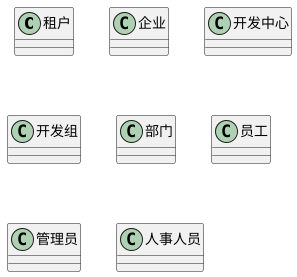

# 领域建模实践·上

以前看过一些 UML 的书，不过没有练习过，随着工作时间越久越觉得凭着本能去写代码好累。回过头来想一想很多工具都可以让工作负担变轻，所以练起来。

```plantuml
@startuml
class 员工 {
    姓名
    性别
}
@enduml
```

```plantuml
@startuml
class 租户
class 企业
class 开发中心
class 开发组
class 部门
class 员工
class 管理员
class 人事人员
@enduml
```
