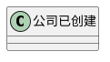
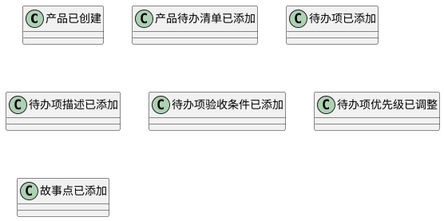
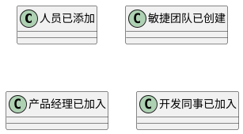
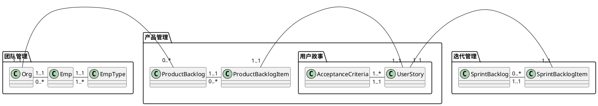
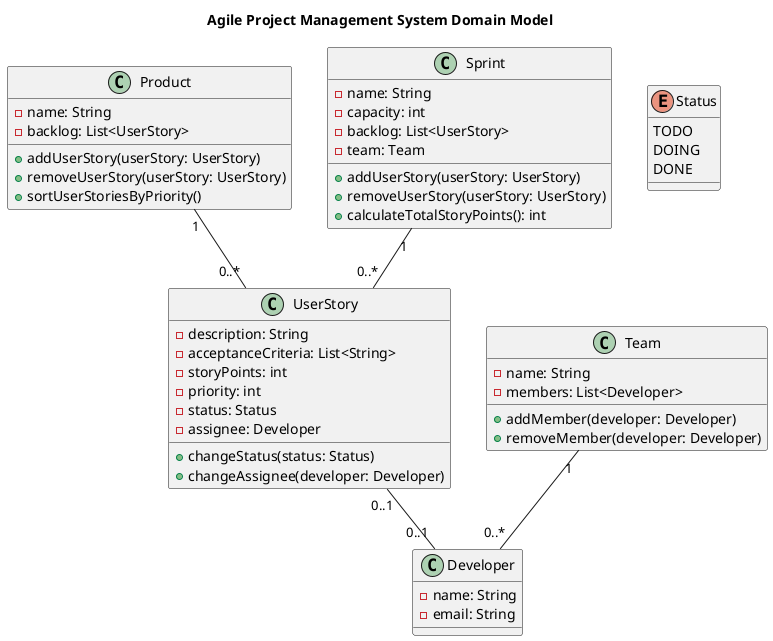
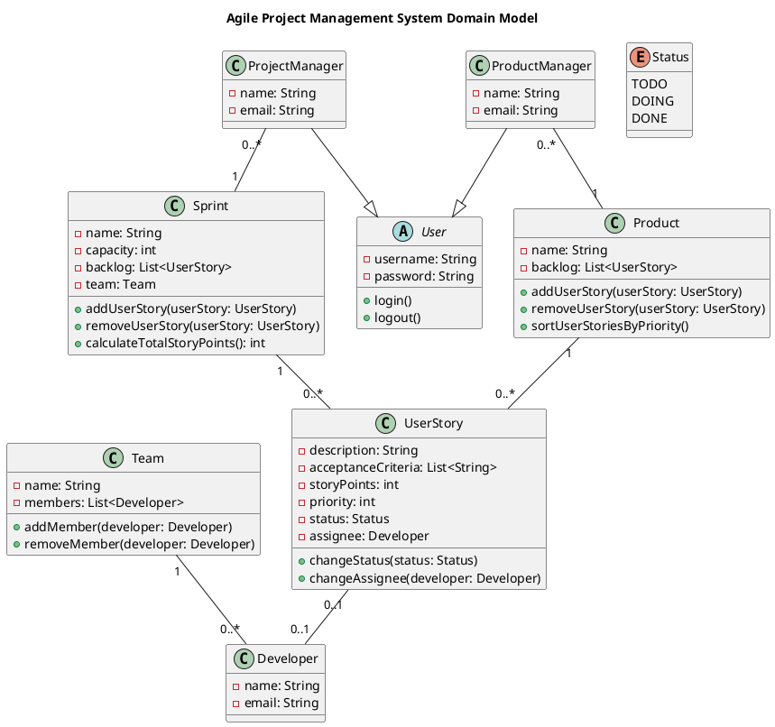
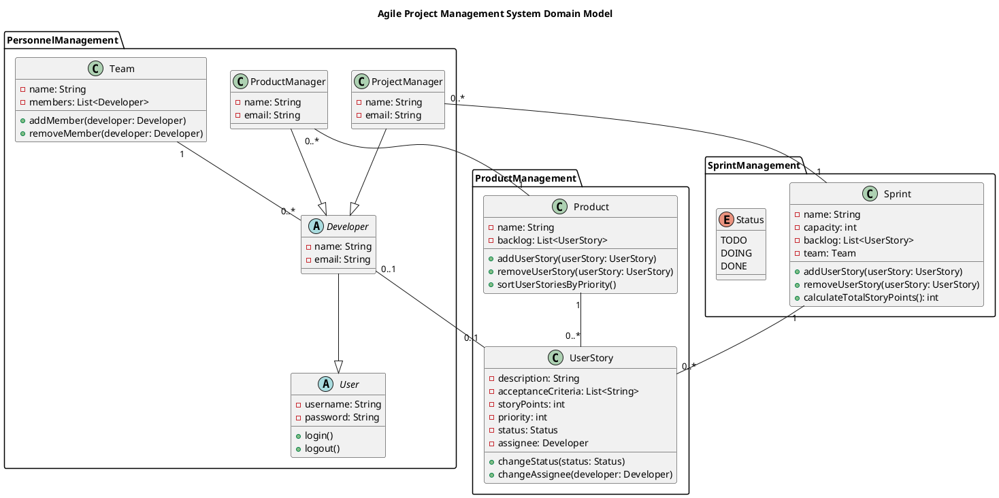

# 建模练习一

## 需求

假设你所在的公司想实施敏捷软件开发，委托你为公司开发一个敏捷项目管理软件。公司领导提出来的需求是这样的。

- 公司会开发很多款软件产品，每个产品有一个产品待办清单（product backlog）
- 产品待办清单中的待办项是用户故事，由产品经理提供
- 用户故事有一个文字性的描述，还有若干验收条件（Acceptance Criteria）
- 产品经理可调整待办项的优先级
- 每个用户故事要估算故事点
- 每个迭代，项目经理把用户故事移入迭代待办清单（sprint backlog）
- 每个迭代，由一个敏捷团队负责
- 迭代待办清单所有故事点的和不能超过迭代容量
- 每个用户故事由一个同事负责
- 每个用户故事有 todo、doing、done 三种状态，由开发人员切换状态

请根据上面的场景，用 plantuml 绘制出系统的领域模型。

## 领域事件

### 公司



### 产品待办清单



### 迭代待办清单

```plantuml
@startuml
class    迭代已创建
class    敏捷团队已分配
class    待办项已移入 <--> 迭代待办清单所有故事点不能超过迭代容量
class    负责同事已分配
class    待办项状态已改变 <--> 开发人员才能切换状态
class    迭代已完成
@enduml
```

### 敏捷团队



## 建模

### 领域名词与命令

- 公司
  - backlog 系统
  - 创建公司
  - 公司已创建
- 产品待办清单
  - 产品经理
  - 添加产品待办清单
  - 产品待办清单已添加
- 待办项
  - 产品经理
  - 添加待办项
  - 待办项已添加
- 验收条件
  - 产品经理
  - 添加验收条件
  - 验收条件已添加
- 故事点
  - 产品经理
  - 添加故事点
  - 故事点已添加
- 迭代清单
  - 项目经理
  - 添加迭代清单
  - 迭代清单已添加
- 待办项
  - 项目经理
  - 移入待办项
  - 待办项已移入
- 敏捷团队
  - 项目经理
  - 添加团队
  - 敏捷团队已添加
- 人员
  - 管理员
  - 添加人员
  - 人员已添加

### 统一语言词汇表

| 分类     | 中文         | 英文                | 英文简称 |
| -------- | ------------ | ------------------- | -------- |
| 通用     | 经理         | manager             | mng      |
| 通用     | 成员         | member              |          |
| 通用     | 负责人       | leader              |          |
| 研发管理 | 用户故事     | user story          |          |
| 研发管理 | 产品待办清单 | product backlog     |          |
| 研发管理 | 迭代待办清单 | sprint backlog      |          |
| 研发管理 | 验收条件     | acceptance criteria |          |
| 研发管理 | 故事点       | story points        |          |
| 研发管理 | 项目         | project             |          |
| 组织管理 | 团队         | organization        | org      |
| 组织管理 | 员工         | employee            | emp      |

### 建模类图



### New Bing ChatGPT 版



补充实体后：



分包：


